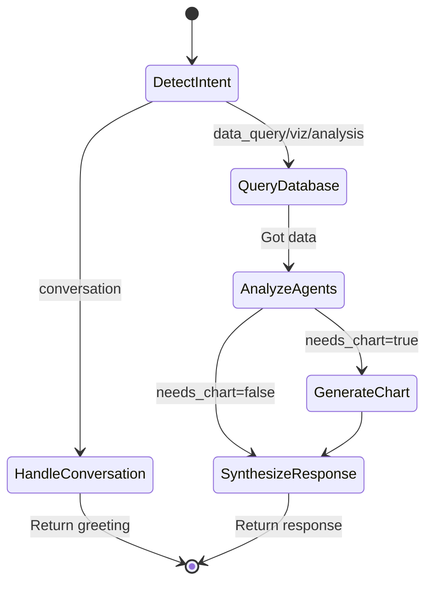
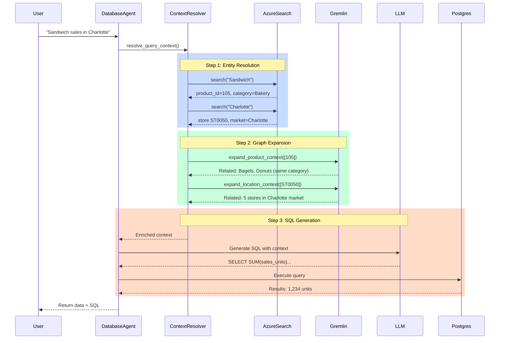

# Planalytics GenAI Solution - Architecture Diagram

## System Architecture Overview

```mermaid
graph TB
    %% Frontend Layer
    User[👤 User]
    Frontend[🖥️ Frontend<br/>Next.js + React]
    
    %% API Layer
    API[🚪 FastAPI<br/>routes/chatbot.py]
    
    %% Orchestration Layer
    Orchestrator[🎯 Orchestrator Agent<br/>LangGraph Workflow]
    
    %% Intent Detection
    Intent[🧠 Intent Detection<br/>conversation | data_query<br/>visualization | analysis]
    
    %% Specialized Agents
    Database[💾 Database Agent<br/>SQL Generation]
    Visualization[📊 Visualization Agent<br/>Chart Generation]
    Weather[🌤️ Weather Agent<br/>Impact Analysis]
    Events[🎉 Events Agent<br/>Event Insights]
    Location[📍 Location Agent<br/>Geographic Context]
    Inventory[📦 Inventory Agent<br/>Stock Alerts]
    
    %% Context Resolution Layer
    ContextResolver[🔍 Context Resolver<br/>Entity Resolution]
    RAG[📚 RAG Pipeline<br/>Vector Search]
    
    %% Data Sources
    AzureSearch[🔎 Azure AI Search<br/>11 Indexes<br/>Vector + Hybrid Search]
    Gremlin[🕸️ Cosmos DB Gremlin<br/>Knowledge Graph<br/>Relationship Expansion]
    Postgres[(🗄️ PostgreSQL<br/>Transactional Data<br/>sales | batches | metrics)]
    
    %% AI Services
    AzureOpenAI[🤖 Azure OpenAI<br/>GPT-4 / o3-mini<br/>LLM + Embeddings]
    
    %% Flow
    User -->|"Query:<br/>Show sales for Sandwiches<br/>in Charlotte"| Frontend
    Frontend -->|POST /api/v1/chat| API
    API -->|orchestrate(query, context)| Orchestrator
    
    Orchestrator -->|Step 1| Intent
    Intent -->|Route by Intent| Orchestrator
    
    Orchestrator -->|Step 2:<br/>conversation intent| Orchestrator
    Orchestrator -->|Step 2:<br/>data/viz/analysis| Database
    
    Database -->|resolve_query_context()| ContextResolver
    ContextResolver -->|Azure Search:<br/>Resolve entities| AzureSearch
    ContextResolver -->|Gremlin:<br/>Expand relationships| Gremlin
    
    AzureSearch -->|Products: Sandwiches<br/>Locations: ST0050| ContextResolver
    Gremlin -->|Related: Bakery items<br/>Charlotte stores| ContextResolver
    
    ContextResolver -->|Enriched Context| Database
    Database -->|Generate SQL<br/>with context| AzureOpenAI
    AzureOpenAI -->|SQL Query| Database
    Database -->|Execute Query| Postgres
    Postgres -->|Results: 1,234 units| Database
    
    Database -->|db_result| Orchestrator
    
    Orchestrator -->|Step 3:<br/>Analyze with agents| Weather
    Orchestrator -->|Step 3| Events
    Orchestrator -->|Step 3| Location
    Orchestrator -->|Step 3| Inventory
    
    Weather -->|Weather impact: +12%| Orchestrator
    Events -->|Music festival nearby| Orchestrator
    Location -->|Region: Southeast| Orchestrator
    Inventory -->|Stock: Adequate| Orchestrator
    
    Orchestrator -->|Step 4:<br/>needs_chart=true| Visualization
    Visualization -->|Analyze data structure| AzureOpenAI
    AzureOpenAI -->|Best chart: ColumnChart| Visualization
    Visualization -->|Chart spec JSON| Orchestrator
    
    Orchestrator -->|Step 5:<br/>Synthesize response| Orchestrator
    Orchestrator -->|Response:<br/>answer + SQL + chart| API
    API -->|ChatResponse JSON| Frontend
    Frontend -->|Render UI| User
    
    %% Styling
    classDef frontend fill:#61dafb,stroke:#333,stroke-width:2px,color:#000
    classDef api fill:#009688,stroke:#333,stroke-width:2px,color:#fff
    classDef orchestrator fill:#ff9800,stroke:#333,stroke-width:3px,color:#000
    classDef agent fill:#4caf50,stroke:#333,stroke-width:2px,color:#fff
    classDef context fill:#9c27b0,stroke:#333,stroke-width:2px,color:#fff
    classDef database fill:#2196f3,stroke:#333,stroke-width:2px,color:#fff
    classDef ai fill:#f44336,stroke:#333,stroke-width:2px,color:#fff
    
    class User,Frontend frontend
    class API api
    class Orchestrator,Intent orchestrator
    class Database,Visualization,Weather,Events,Location,Inventory agent
    class ContextResolver,RAG context
    class AzureSearch,Gremlin,Postgres database
    class AzureOpenAI ai
```

---

## Detailed Component Breakdown

### 🎯 **1. Orchestrator Layer (Brain)**


**Workflow States:**
- **detect_intent** - Classify query intent using LLM
- **handle_conversation** - Simple chat responses (greetings)
- **query_database** - SQL generation & execution
- **analyze_agents** - Weather, Events, Location, Inventory insights
- **generate_chart** - Smart visualization recommendation
- **synthesize_response** - Combine all results

---

### 🔍 **2. Context Resolution Flow**


---

### 📊 **3. Data Flow Architecture**
```mermaid
graph LR
    subgraph "External Services"
        OpenAI[Azure OpenAI<br/>GPT-4 / o3-mini]
        Search[Azure AI Search<br/>Vector Search]
        Graph[Cosmos DB Gremlin<br/>Knowledge Graph]
    end
    
    subgraph "Backend Core"
        API[FastAPI API]
        Orch[Orchestrator]
        
        subgraph "Agents"
            DB[Database Agent]
            Viz[Visualization Agent]
            Wx[Weather Agent]
            Evt[Events Agent]
            Loc[Location Agent]
            Inv[Inventory Agent]
        end
        
        subgraph "Services"
            Ctx[Context Resolver]
            RAG[RAG Pipeline]
        end
    end
    
    subgraph "Data Layer"
        PG[(PostgreSQL<br/>sales | batches<br/>metrics | events)]
    end
    
    API --> Orch
    Orch --> DB & Viz & Wx & Evt & Loc & Inv
    DB --> Ctx
    Ctx --> Search & Graph
    DB --> OpenAI
    Viz --> OpenAI
    DB --> PG
    
    style OpenAI fill:#f44336,color:#fff
    style Search fill:#2196f3,color:#fff
    style Graph fill:#2196f3,color:#fff
    style PG fill:#336791,color:#fff
    style Orch fill:#ff9800,color:#000
```

---

## 🔑 Key Design Patterns

### **1. Multi-Agent Collaboration**
- **Orchestrator** coordinates specialized agents
- Each agent has domain expertise (weather, events, inventory)
- Agents work in parallel when possible
- Results aggregated for comprehensive insights

### **2. Retrieval-Augmented Generation (RAG)**
- **Phase 1**: Retrieve context from Azure Search + Gremlin
- **Phase 2**: Augment LLM prompt with retrieved context
- **Phase 3**: Generate accurate, grounded SQL queries
- Reduces hallucination, improves accuracy

### **3. Hybrid Search**
- **Vector Search**: Semantic similarity (embeddings)
- **Keyword Search**: Exact matches (BM25)
- **Graph Traversal**: Relationship expansion
- Combined approach for robust entity resolution

### **4. Dynamic Schema Context**
- SQL prompts adapt based on query type
- Only includes relevant tables/columns
- Reduces token usage and improves accuracy
- Prevents confusion between similar tables

### **5. Smart Visualization**
- LLM analyzes data structure + query intent
- Recommends optimal chart type (bar, line, pie, map)
- Generates Google Charts-compatible JSON
- Auto-detects chartable data patterns

---

## 📦 Technology Stack

| Layer | Technology | Purpose |
|-------|-----------|---------|
| **API** | FastAPI | Async web framework |
| **Orchestration** | LangChain + LangGraph | Agent workflow management |
| **AI/LLM** | Azure OpenAI (GPT-4, o3-mini) | Natural language understanding |
| **Vector Search** | Azure AI Search | Entity resolution, semantic search |
| **Knowledge Graph** | Cosmos DB Gremlin | Relationship expansion |
| **Transactional DB** | PostgreSQL | Sales, inventory, metrics data |
| **ORM** | SQLAlchemy | Database abstraction |
| **Validation** | Pydantic | Request/response schemas |
| **Logging** | Python logging | Structured logs |

---

## 🚀 Request Flow Example

**User Query:** *"Show me a chart of ice cream sales during heatwave weeks"*

1. ✅ **API receives request** → `POST /api/v1/chat`
2. ✅ **Intent detection** → `visualization` (chart keyword detected)
3. ✅ **Context resolution**:
   - Azure Search: "ice cream" → product_id=234, category=Frozen Desserts
   - Azure Search: "heatwave" → event dates in July-August 2025
   - Gremlin: Expands to related products (popsicles, frozen yogurt)
4. ✅ **SQL generation** with enriched context:
   ```sql
   SELECT c.end_date, SUM(s.sales_units) as total_units
   FROM sales s
   JOIN product_hierarchy ph ON s.product_code = ph.product_id
   JOIN calendar c ON s.transaction_date = c.end_date
   WHERE ph.product = 'Ice Cream'
   AND c.end_date BETWEEN '2025-07-01' AND '2025-08-31'
   GROUP BY c.end_date
   ORDER BY c.end_date
   ```
5. ✅ **Execute on Postgres** → 8 weeks of data
6. ✅ **Agent analysis**:
   - Weather Agent: Detected 15% above-normal temperatures
   - Events Agent: 4th of July holiday, summer concerts
   - Location Agent: Highest sales in Southeast region
7. ✅ **Visualization**: LLM picks `LineChart` (time series trend)
8. ✅ **Response synthesis**: 
   - Answer: "Ice cream sales peaked during heatwave weeks..."
   - Chart: Line graph with 8 data points
   - SQL: Full query included
   - Insights: Weather impact +15%, holiday boost +20%

---

## 🎨 Architecture Highlights

✅ **Modular & Extensible** - Easy to add new agents or data sources  
✅ **Fault Tolerant** - Graceful degradation if Gremlin unavailable  
✅ **Scalable** - Async operations, connection pooling  
✅ **Observable** - Comprehensive logging at each step  
✅ **Context-Aware** - Maintains conversation history (via session_id)  
✅ **Smart** - LLM-powered decisions at every layer  

---

## 📝 Future Enhancements

- [ ] **Chat History** - Azure Cosmos DB for conversation persistence
- [ ] **Caching** - Redis for frequently asked queries
- [ ] **Streaming** - Server-Sent Events for real-time responses
- [ ] **Multi-tenancy** - Hierarchical partition keys for org isolation
- [ ] **A/B Testing** - Compare different agent strategies
- [ ] **Fine-tuning** - Domain-specific SQL generation models

---

*Generated on January 14, 2026 | Planalytics GenAI Solution v1.0.0*
